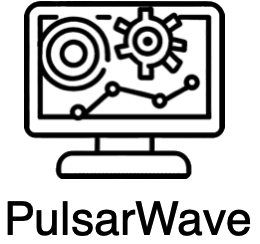

# PulsarWave




## Introduction


The Automated Trend Monitoring Radar (TMR), PulsarWave, is an innovative technology that uses advanced Machine Learning (ML) algorithms to sift through, evaluate, and draw insights from a sea of data amassed from news feeds. This sophisticated tool stands on the principle of a posteriori knowledge, creating new insights through the processing and analysis of empirical data. It utilizes Natural Language Processing (NLP), a pivotal subset of artificial intelligence, to parse and understand text-based data, thereby identifying and following emerging trends in the rapidly changing world of digital media.

What sets TMR apart from typical "social listening" tools is its ability to prioritize the importance and relevance of emerging news, focusing on the quality of information rather than just its popularity or frequency of mention. Instead of merely detecting what's "trending", TMR aims to highlight substantial news items that indicate a real shift or development in the current landscape, be it political, social, or economic. Companies can leverage it to monitor sentiment and foresee market trends, enhancing their strategic planning and decision-making processes. In public health, it could be instrumental in early disease detection or tracking health trends based on reported experiences. Policymakers can harness it to understand public sentiment around key issues, making informed decisions that truly reflect the needs of their constituents. Furthermore, TMR could play a critical role in combating disinformation by identifying and prioritizing factual, significant news over popular yet potentially misleading information. Through its advanced capabilities, the Automated Trend Monitoring Radar doesn't just echo the digital world's noise—it carefully selects and amplifies the most meaningful signals, making it an invaluable tool for a wide array of real-world applications.  

The Trend Monitoring Radar has been modified from Zalando's [public Tech Radar](http://zalando.github.io/tech-radar/)

## Application

PulsarWave can be versatilely applied in various applications, such as portfolio management. It provides valuable insights for portfolio investment, as demonstrated in the following article at Geopolitics.asia: [Weekly Trend Radar and Portfolio Investment](https://www.geopolitics.asia/post/weekly-trend-radar-and-portfolio-investment). Additionally, PulsarWave can be utilized to generate materials for daily news analysis. It powers AI discussions in a simulated podcast radio format, featuring engaging conversations between female and male hosts. Check out the following video for a glimpse of the discussions: 

[](https://www.youtube.com/watch?v=Fwwn_5m6X4E)

Please try and view:
- [http://3.88.22.149:3000](http://3.88.22.149:3000) for Amazon Web Service (AWS)
- [www.geopolitics.io](http://www.geopolitics.io) for Google Cloud Platform (GCP)
 - [Our presentation slide](https://drive.google.com/file/d/1LdCYfFRB2r4L94og8JsgWcceiecW29_W/view?usp=sharing) to see project overview
 - [Our design concept](https://sikkha.medium.com/trend-monitoring-resource-4c14b79a512) for social media resources
 - [Our white paper](https://drive.google.com/file/d/1hKPXY-d2aCuMFf8mmY8R_MkjnoKdjlLc/view) for technical concept
 

Note:
The [2022 Wikipedia dataset](https://huggingface.co/datasets/wikipedia/viewer/20220301.en/train) was uploaded to the Pinecone vector database following the concept presentd in [Langchain Retrieval Augmentation](https://docs.pinecone.io/docs/langchain-retrieval-augmentation). This approach was taken to enrich the knowledge of the GPT model beyond its original cutoff date in 2021.

## License Change

We have made the decision to transition PulsarWave from the GNU General Public License version 3.0 (GPL-3.0) to the Apache License 2.0. We have chosen to change the license from GPL-3.0 to the Apache License 2.0 for the following reasons:

1. **Compatibility with MIT**: By adopting the Apache License, which is compatible with the MIT License, we ensure compatibility and harmonization with other open-source software, such as tech-radar, that is licensed under the MIT License.

2. **Permissive Licensing**: The Apache License 2.0 is a permissive open-source license that grants users the freedom to use, modify, and distribute the software, both commercially and non-commercially. This permissiveness encourages wider adoption, collaboration, and integration of PulsarWave into various projects and ecosystems.

3. **Business Flexibility**: The Apache License enables flexibility for commercial usage of PulsarWave. It allows individuals and organizations to incorporate our software into their commercial products and services without the requirement of open-sourcing their proprietary code. This facilitates commercialization and supports the growth of businesses built around PulsarWave.

4. **No Copyleft Provision**: Unlike the GPL-3.0, the Apache License does not include a copyleft provision. This means that derivative works or modifications based on PulsarWave can be licensed under different terms, including proprietary licenses. This offers more freedom for the community to create derivative works while maintaining compatibility with the Apache License.

## Contribution

PulsarWave is currently maintained by Siam Intelligence Unit Co., Ltd (SIU). We welcome community contributions and value collaboration. Please review the [CONTRIBUTING.md](./CONTRIBUTING.md) file for more information on how to contribute to the project.

## Versioning

Starting from version 1.0, PulsarWave will be licensed under the Apache License 2.0. All previous versions of the software remain under the GPL-3.0.

We believe that this license change enhances compatibility, promotes collaboration, and provides the necessary flexibility for both non-commercial and commercial usage of PulsarWave. We appreciate your support and look forward to your continued involvement in the project.

## Workflow Diagram


**Note please revise your own API_KEY**

## How to use

1\. Export your [OpenAI API key](https://platform.openai.com/account/api-keys) as `OPENAI_API_KEY` and related tweeter API keys in run_ai_process.sh. Please monitor crontab.txt to observe the sequence of the process.

```console
$ cd src
$ export OPENAI_API_KEY=YOUR_API_KEY
```

2\. Install the lastest version of the `openai` python package
```console
$ pip install --upgrade openai
```

3\. Run the script, and check the results. And then from the output file, you can run the tech-radar/docs/generate_tech_radar.sh

```console
$ ./run_ai_process.sh
$ ./weekly_pestle_summary.sh 
$ cd ../trend-radar/docs
$ cp ../src/revised_accu_process_tweet.txt ./entry.txt
$ ./generate_trend_radar.sh
```

4\. Start Trend Radar

```console
$ cd ..
$ yarn start
```